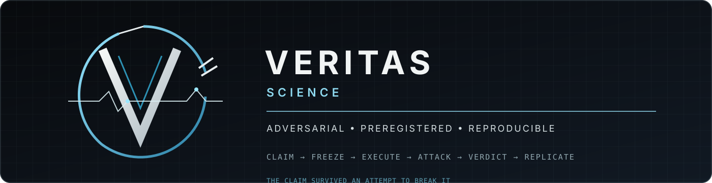

# veritas-science

<p align="center">
  
</p>

<p align="center"><strong>Scientific validation as an instrument: preregister the claim, freeze the protocol, attack the verifier.</strong></p>

MIT-licensed scientific validation framework for claims, evidence, protocol execution, verifier qualification, and adversarial probing.

## Core principle

A result is not meaningful because a script printed a number or a model emitted a verdict. It is meaningful only when the claim is explicit, the protocol is fixed, the evidence is classified, the verifier is fail-closed, provenance is recorded, and the verifier has survived an attempt to break it.

## Design principles

- Evidence state is not research status.
- Measured evidence is admissible input, never support by itself.
- Prediction status, verifier status, and claim verdict remain separate.
- Missing, inferred, defaulted, or untrusted evidence never becomes measured evidence.
- Positive claims require explicit contracts.
- A gate that cannot fail is not evidence.
- Reproduction is not verification.
- External implementations are pinned adapters, not implicit evidence.

## Quick start

```bash
python -m venv .venv
source .venv/bin/activate
pip install -e .
python -m veritas demo --out run
pytest -q
```

The demo exercises the original deterministic threshold experiment. The evidence API is separate: `fail_closed()` checks admissibility, while `claim_verdict()` requires the protocol, verifier, and prediction layers before returning a claim verdict.

## Canonical workflow

```text
CLAIM → PREREGISTERED → FROZEN → EXECUTED
     → EVIDENCE ADMISSIBILITY + VERIFIER ATTACKS
     → PREDICTION TEST → CLAIM VERDICT → REPLICATION
```

## Scope

The core provides:

- evidence states and research statuses
- provenance manifests
- prediction, verifier, and claim verdict semantics
- contract-style validation
- static anti-vacuity checks
- mutation-style dependence checks
- pinned external adapter boundaries

Domain-specific detectors and models belong in adapters that record their repository, exact commit, environment, and limitations.

## First adapter

The first formal adapter is the Sentinel HAI benchmark boundary. It records the external repository, exact commit, gate family, required manifest fields, and limitations without importing the external implementation.

## Open-source components

Potential optional integrations are documented in [`docs/open-source-components.md`](docs/open-source-components.md). Current candidates include `python-jsonschema/jsonschema` for schema validation, `sixty-north/cosmic-ray` for mutation execution, and `ORNL/flowcept` for runtime provenance. Their licenses and versions must be recorded independently; no third-party tool is allowed to decide a Veritas claim verdict.

## License and attribution

MIT. See [`LICENSE`](LICENSE), [`ATTRIBUTION.md`](ATTRIBUTION.md), and [`docs/integration.md`](docs/integration.md).

## Author

Chad Edward Holland
