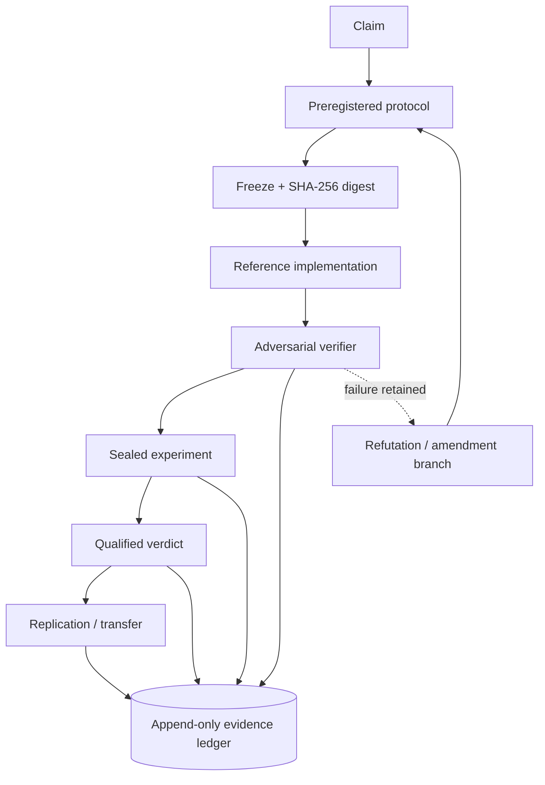

# Veritas architecture

## Runtime boundaries

| Boundary | Input | Output | Safety property |
|---|---|---|---|
| Protocol | Claim, assumptions, null, predictions | Frozen protocol | No silent post-hoc changes |
| Instrument | Frozen protocol + data | Deterministic result | Implementation is not evidence |
| Attacker | Protocol + verifier | Attack report | Verifier must be falsifiable |
| Verdict | Attack report + result | Qualified status | No unconditional truth claim |
| Ledger | All artifacts | Hash chain | Tampering is detectable |

The supplied threshold implementation is a reference instrument only. Production adapters should preserve these boundaries and add domain-specific statistics, missingness, dependence, uncertainty, and multiple-comparison controls.
